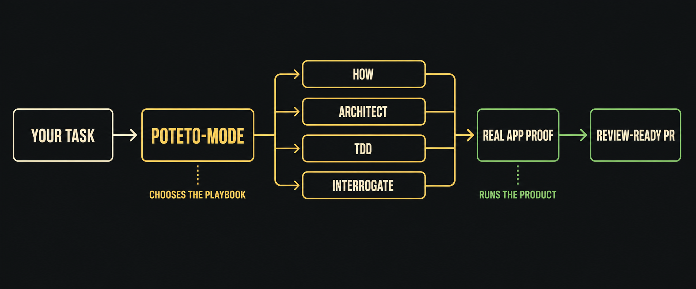

# Engineering Toolkit

This repository is a fork of [Open Pstack](https://github.com/ericlitman/open-pstack). Open Pstack made [Lauren Tan's Cursor pstack plugin](https://github.com/cursor/plugins/tree/main/pstack) work in Claude Code and Codex.

This fork uses that work as a base. One skill tree should parent on Cursor, Claude Code, Codex, and later other coding agents. Today it ships those three parents. It tracks both Open Pstack and Cursor's pstack and pulls in changes as needed.

The intended GitHub remote is [cameronjlarsen/engineering-toolkit](https://github.com/cameronjlarsen/engineering-toolkit). That copy is not published yet. Install from this checkout until it is. Do not install Lauren's original pstack or `ericlitman/open-pstack` as a stand-in for this fork.

Lauren built pstack from the skills she uses to ship code at Cursor. In a [55-minute interview with Denis Labelle](https://x.com/DenisLabelle/status/2091337807939706928), she says that she shipped 1,000 pull requests in one month after steadily improving how her agents work and verify their results.

> If you want to go fast, go deep first.

## What Engineering Toolkit does

Engineering Toolkit is a plugin for coding agents. The workflows came from pstack. It is not a new model or a hosted service. It gives your agent engineering rules, step-by-step workflows for different kinds of work, focused skills, and small local tools.

The normal entry point is `engineering-mode`. You give it a task in plain language. It then:

- reads the task and chooses a workflow that fits;
- learns how the current system works before changing it;
- compares designs when the choice matters;
- favors small, simple changes over extra machinery;
- asks several models to challenge important decisions when useful;
- runs the code and checks real behavior instead of stopping at “the tests pass”; and
- carries the work through review, continuous integration (CI), and a ready-to-merge pull request when asked.



Engineering Toolkit does not ask you to trust an agent on day one. It helps the agent leave evidence you can inspect. Start with supervised work. Let it run more work in parallel only after its checks have earned that trust in your own repositories.

## Install

You need a current Cursor, Claude Code, or Codex installation. For the full four-model review, install and sign in to the Claude Code, Codex, and Grok command-line tools. [Bun](https://bun.sh) runs the small local tool that starts models outside the app you are using. You can still use the core workflows with fewer models.

Until [cameronjlarsen/engineering-toolkit](https://github.com/cameronjlarsen/engineering-toolkit) is published, install from this checkout. The skill tree stays at `plugins/engineering-toolkit`. That directory holds the Cursor, Claude Code, and Codex manifests.

### Cursor

Install `plugins/engineering-toolkit` from this checkout (the `.cursor-plugin` manifest). Do not install Lauren's original pstack alongside it. Then run `/setup-engineering-toolkit`. Setup writes grammar 2 into `~/.cursor/rules/engineering-toolkit-models.mdc`. It does not write upstream Task slugs.

### Claude Code

From this checkout, add the repo as a local marketplace, then install `eng@engineering-toolkit` and reload plugins.

### Codex

From this checkout, add the repo as a local Codex marketplace, then add `eng`.

Turn on Codex subagents in `~/.codex/config.toml` so Engineering Toolkit can compare work in parallel:

```toml
[features]
multi_agent = true
```

Start a new Codex task after installation so it can discover the new skills and setting.

## Get started

Lauren's original setup has two steps. This fork keeps the same flow.

### 1. Set up the models

In Claude Code, run:

```text
/eng:setup-engineering-toolkit
```

In Codex, ask:

```text
Use eng:setup-engineering-toolkit to configure Engineering Toolkit.
```

In Cursor, run:

```text
/setup-engineering-toolkit
```

Setup checks the models you can actually run, shows how each one will start, and asks before saving the choices. The current default group uses Fable, GPT-5.6 Sol, Grok 4.6, and Opus.

An older model sheet starts using the rolling aliases in memory as soon as this release is installed. Run setup once after updating to persist that migration. It replaces versioned Fable and Opus entries while preserving every role assignment and effort selection.

### 2. Use engineering-mode

Start any task that needs careful engineering with `engineering-mode`.

In Claude Code:

```text
/eng:engineering-mode Add saved filters to search. Keep the design simple, verify it in the real app, and open a pull request.
```

In Codex:

```text
Use eng:engineering-mode. Add saved filters to search. Keep the design simple, verify it in the real app, and open a pull request.
```

In Cursor:

```text
/engineering-mode Add saved filters to search. Keep the design simple, verify it in the real app, and open a pull request.
```

For that feature, engineering-mode should first understand how search works today. It should decide how the data should be represented before writing code, implement the smallest complete version, run the feature the way a user would, review the result, and prepare the pull request.

That is the main workflow. The other skills are there when engineering-mode needs them or when you want to call one directly.

## Useful skills

| Skill | Use it when |
| --- | --- |
| `how` | You want a clear explanation of how part of the system works. |
| `why` | You want evidence for why the system was built that way. |
| `architect` | A change crosses a function or module boundary and the design needs to be settled first. |
| `arena` | You want several complete attempts, followed by a comparison of their best parts. |
| `interrogate` | You want different models to try to break a design or diff. |
| `create-verification-skill` | Your project has no repeatable way for an agent to prove real behavior. |
| `maintain-verification-skill` | The project's verification instructions no longer match the product. |
| `babysit` | A pull request needs CI failures and review comments handled until it is ready. |
| `reflect` | A hard task is finished and its lessons should improve the next run. |

Claude Code prefixes plugin skills with `/eng:`. In Claude Code, invoke a native skill such as `/eng:architect`. In Codex, ask for the skill, such as `Use eng:architect for this design.` In Cursor, user-facing skills stay unprefixed. Run `/architect`. See the [technical reference](docs/reference.md) for the full list.

## Models and token use

Some Engineering Toolkit workflows use one model. Skills such as `architect`, `arena`, and `interrogate` can run several models in parallel. Each model run uses the subscription and token allowance of its own command-line tool.

`setup-engineering-toolkit` lets you choose the models, one requested effort per model family, and how many run in parallel. A model from the app you are using runs inside that app. Other models run through their own command-line tools. This fork does not quietly replace a failed model with a weaker one.

## Claude Code, Codex, and Cursor

All three apps read the same skills from `plugins/engineering-toolkit`. Only the way they start those skills and models is different.

| | Claude Code | Codex | Cursor |
| --- | --- | --- | --- |
| Start engineering-mode | Claude loads a small startup instruction that can route non-trivial work into it. You can also run `/eng:engineering-mode` yourself. | Ask for `eng:engineering-mode` by name. Codex does not load the Claude startup instruction. | Run `/engineering-mode`. |
| Runs inside the app | Claude models stay inside Claude Code. | The Sol model stays inside Codex. | Plugin-agent Fable and Opus stay inside Cursor. |
| Other models | Codex and Grok run through their signed-in command-line tools. | Claude and Grok run through their signed-in command-line tools. | Claude, Codex, and Grok run through their signed-in command-line tools. |
| Skills and workflows | Shared. | Shared. | Shared. |

Grok can take part in a multi-model review. You cannot use Grok as the main app running Engineering Toolkit.

## Learn from the original

Lauren's [pstack guide](https://github.com/cursor/plugins/tree/main/pstack/docs/guide) walks through a real task, verification, and longer unattended runs. It uses Cursor's interface. The ideas still apply. Use the skill invocations above in Cursor, Claude Code, or Codex.

This repository also keeps:

- [the original README](README-UPSTREAM.md), unchanged;
- [the technical reference](docs/reference.md) for every skill, dependency, and parent-app detail;
- [the sync record](UPSTREAM.md) for Cursor pstack and Open Pstack;
- [the change record](CHANGES.md) for every adaptation; and
- [the attribution record](NOTICE.md) for pstack and the imported Cursor Team Kit skills.

## Tracked sources

This checkout is at Open Pstack 1.4.1, which tracks Cursor pstack 0.15.1 at commit [`f8abeddd1862dc73704e3d719dd73df0d51b8c71`](https://github.com/cursor/plugins/commit/f8abeddd1862dc73704e3d719dd73df0d51b8c71).

Three version numbers stay independent. Cursor pstack versions Lauren's plugin. Open Pstack versions the Claude Code and Codex port. This fork versions the checkout you are in.

Read [UPSTREAM.md](UPSTREAM.md) before changing content that came from either tracked source. This fork does not promise instant updates. It records the exact commits it follows and reviews new changes in order.

## Contributing

This fork is not yet published. Do not open issues on [ericlitman/open-pstack](https://github.com/ericlitman/open-pstack) for work that belongs here. After [cameronjlarsen/engineering-toolkit](https://github.com/cameronjlarsen/engineering-toolkit) is published, track durable work in that repository's GitHub Issues.

Pull requests must keep one shared skill tree for Cursor, Claude Code, and Codex. They must pass the repository's tests, type checks, plugin validation, and static checks.

## License

MIT. pstack was created by Lauren Tan. Open Pstack builds on Michael Denyer's [pstack-claude](https://github.com/michael-denyer/pstack-claude) port. Engineering Toolkit builds on Open Pstack and includes attributed MIT-licensed work from Cursor Team Kit, Gentle AI (Gentleman Programming), and Superpowers. See [NOTICE.md](NOTICE.md) and the preserved license files for details.
